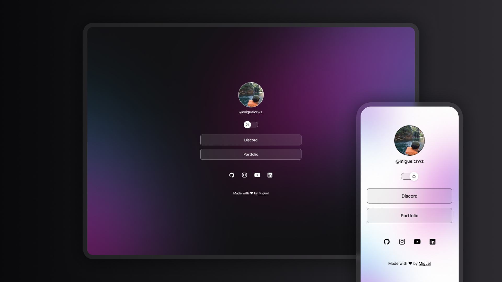

<h1 align = "center"> LINKS </h1>

  Exclusive Program for Studying Web Technologies

  <a href = "#project"> PROJECT </a> &nbsp;&nbsp;&nbsp;|&nbsp;&nbsp;&nbsp;
  <a href = "#technologies"> TECHNOLOGIES </a> &nbsp;&nbsp;&nbsp;|&nbsp;&nbsp;&nbsp;
  <a href = "#license"> LICENSE </a>

  

 

  

## 💻  PROJECT

The "LINKS" project is a link aggregator designed to serve as an online business card.

- [PROJECT ONLINE](https://miguelcrwz.github.io/links)

## 🌐  TECHNOLOGIES

This project was developed using the following technologies:

- HTML and CSS
- JavaScript
- Git and Github
- Figma

## ⚖️  LICENSE

This project is licensed under the MIT License.

---

Made with ♥ by Miguel
